# Proyecto 01 - Grupo 07
## Instalacíón
    
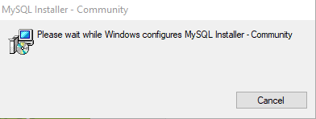
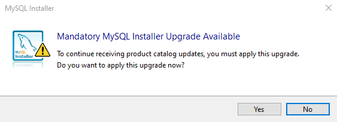
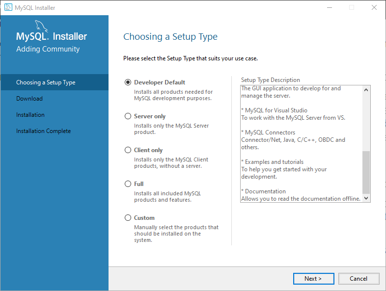
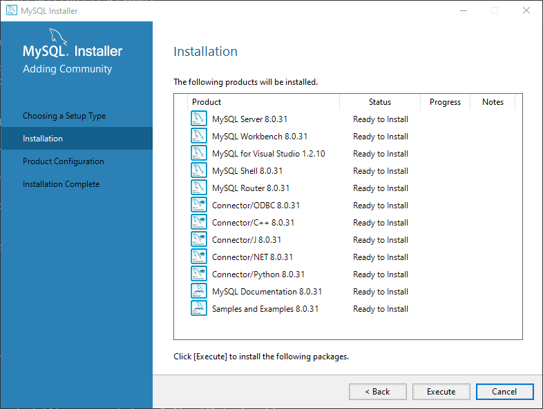
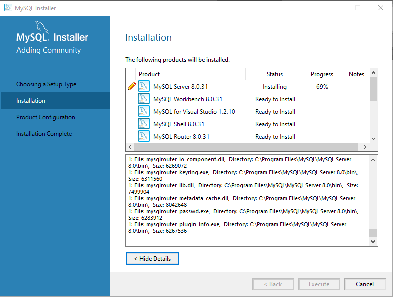
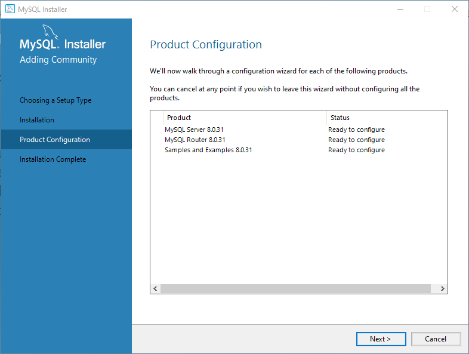
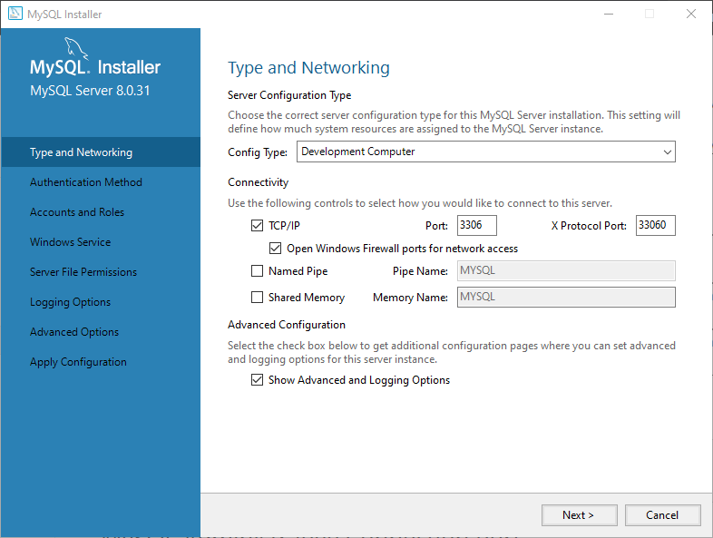
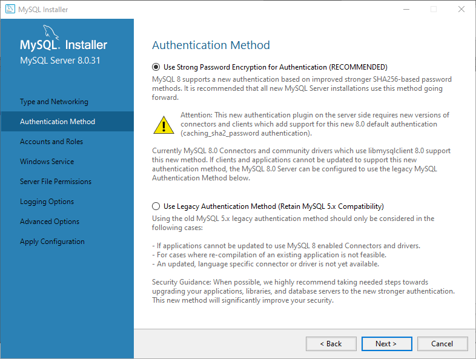
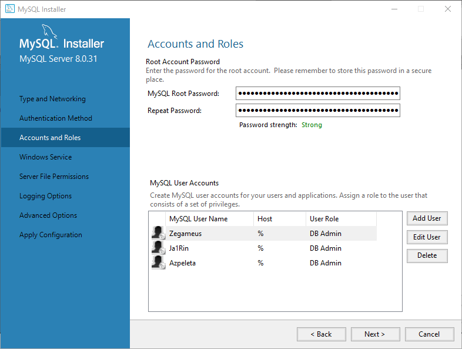
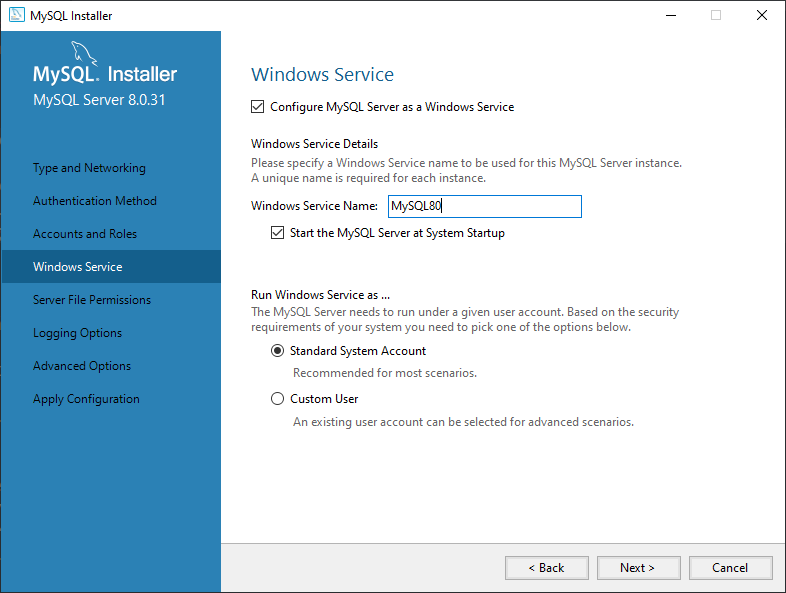
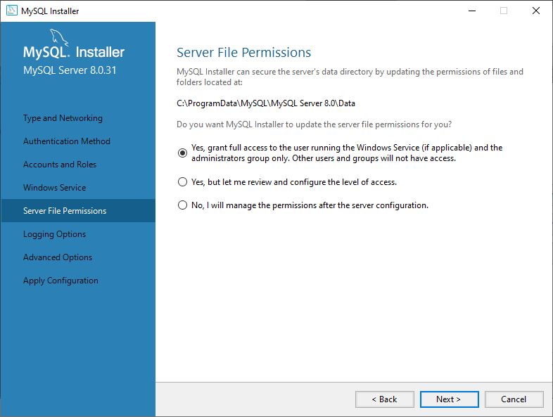
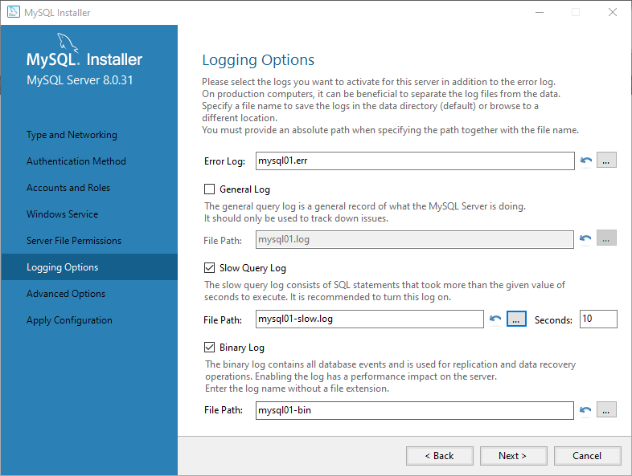
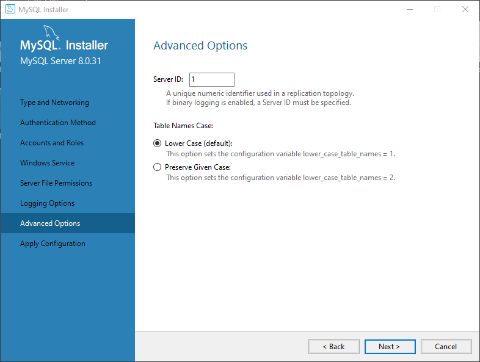
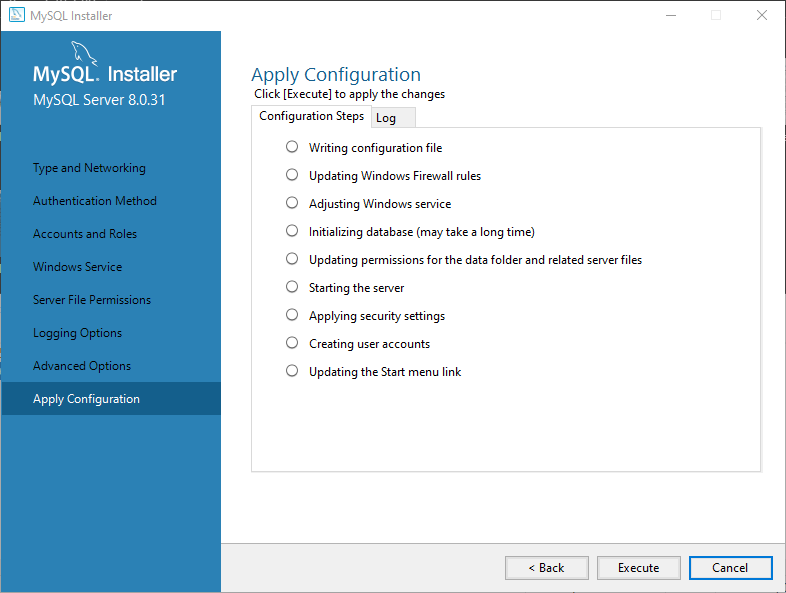
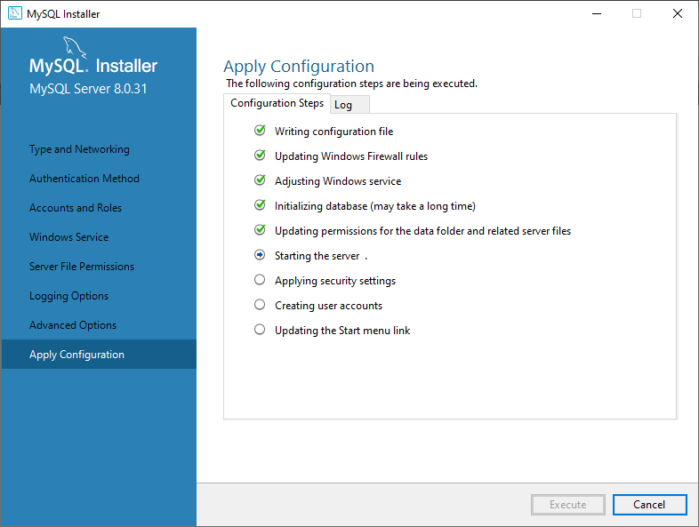
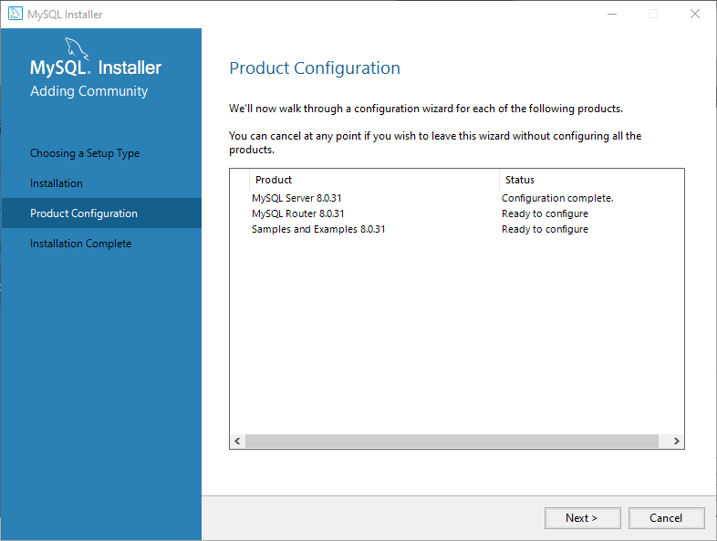
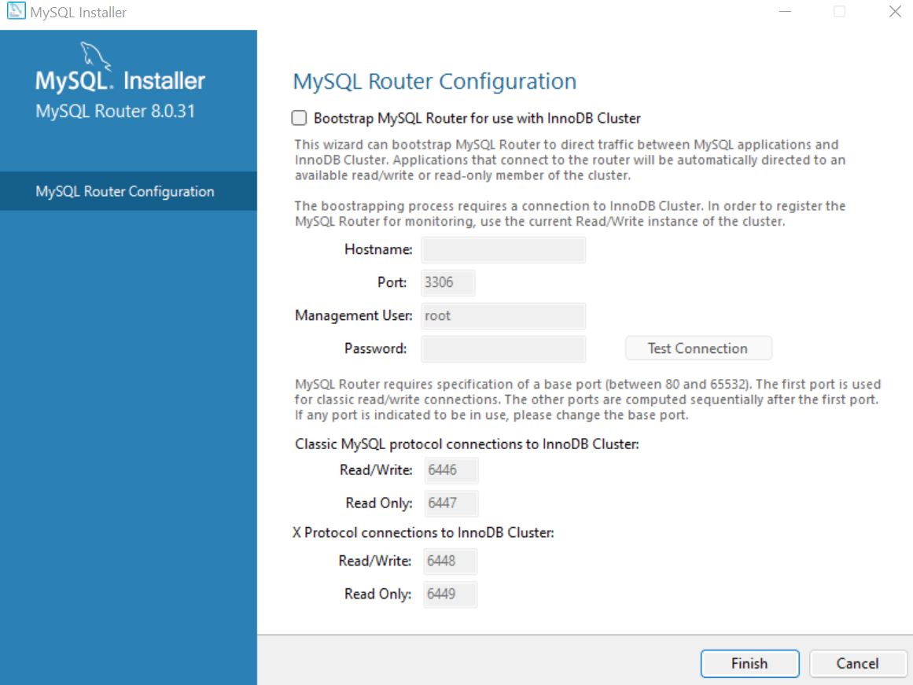
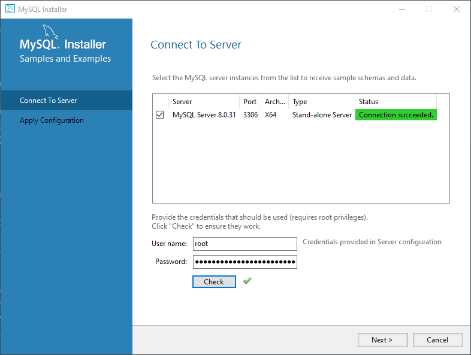
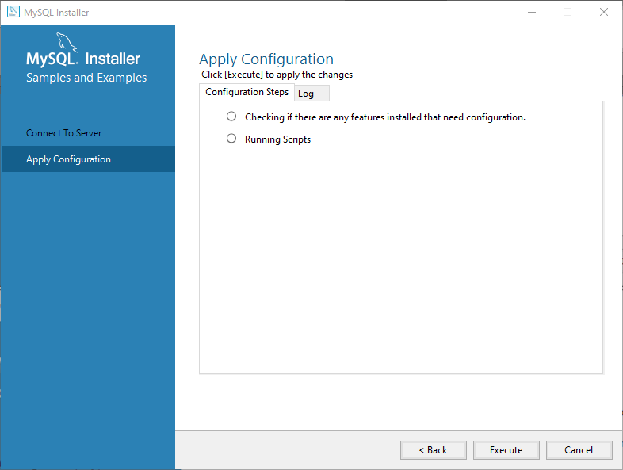
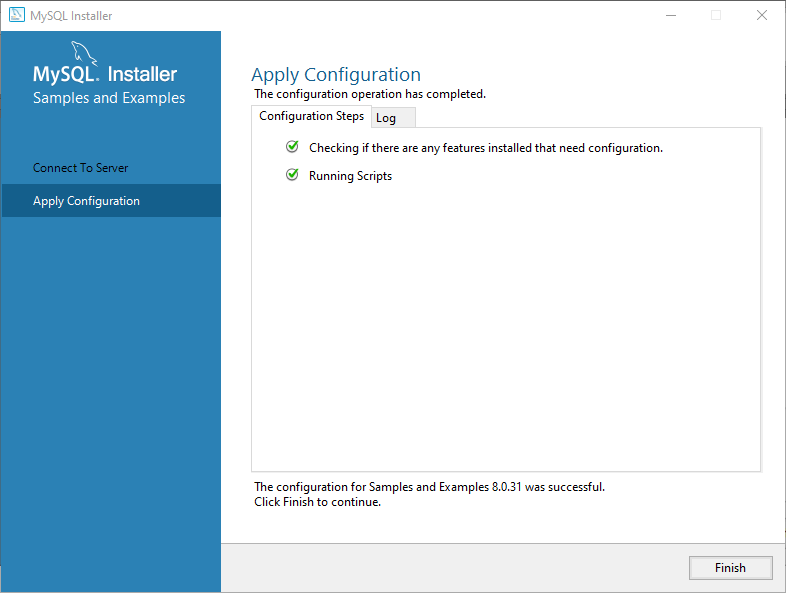
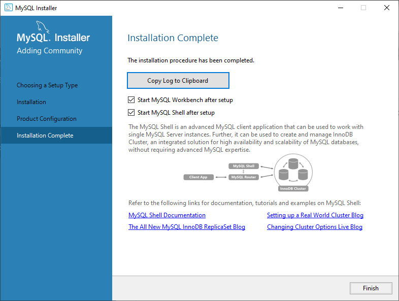

## Usuarios
Root Password: `<456e7R697175654!a6I6J6f417@70656c657461Oa`  
Azpeleta: `<7f980d383e5J99bd6@cK8ab-72b443da!`   
Ja1Rin: `<Aa57e27Ie7f562fJ6d@b9386e!260ba3!`  
Zegameus: `<6f3@Id8647cJ989063e96OOf050da4e2!`

## Diseño
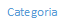
La primera tabla consiste en describir a los atletas, para ello hemos puesto que tiene un codigo,nombre,apellido
pais... Para la proxima creamos una tabla de paises para cada unos de los atletas.
Una tabla de campeonatos con el id de cada uno, el año de celebracion, su continente y pais.
Y por ultimo una de resultados con todas las marcas de cada una de las actividades, el id del atleta en concreto,
el id del campeonatoy la posicion final de cada atleta 

## Conexión
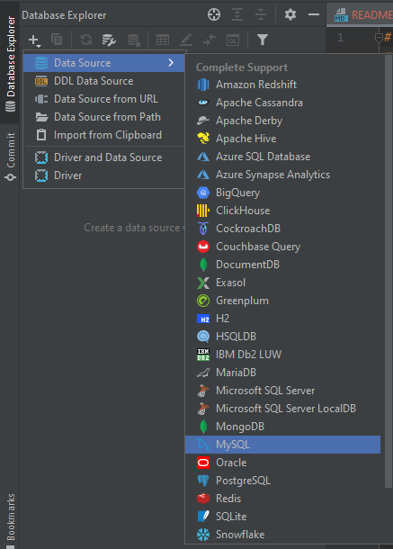
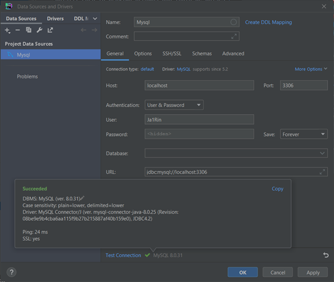
## Conclusiones

### Integrantes
> * David Azpeleta
> * Enrique García
> * Jairo Obispo