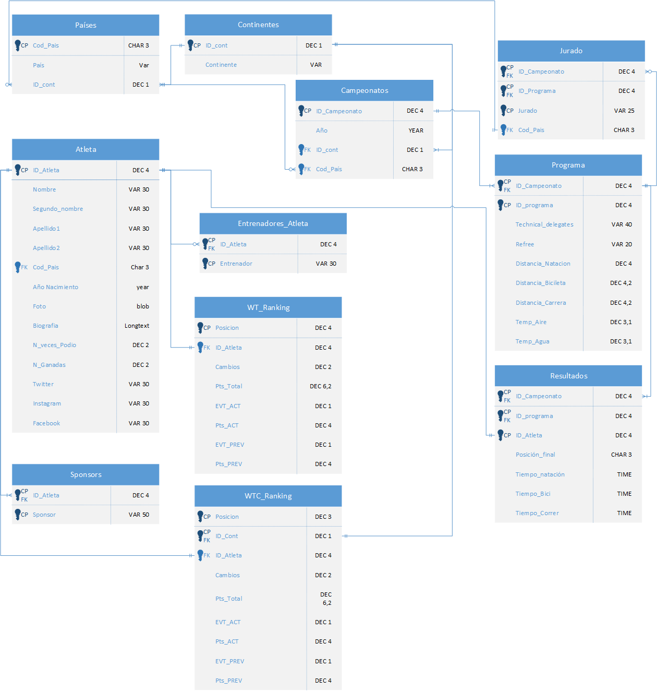

# Proyecto 01 - Grupo 07

### Indice
* [Instalación](#instalación)  
* [Usuarios](#usuarios)  
* [Diseño](#diseño)  
* [Conexión](#conexión)  
* [Conclusión](#conclusiones)  
* [Integrantes](#integrantes)  

## Instalación
    
  
Preparación de la instalación  
  
Actualizar el instalador a la última versión.  
  
Selección de la versión a instalar. En nuestr caso hamos elegido la primera, que viene con todas las herramientas

Nos muestra que paquetes se van a instalar.  

Proceso de instalación.


Inicio de la configuración.

Configuración de internet.

Configuración de la autentificación.

Crear cuentas y asignar contraseña al usuario root

Configurar el servicio de Windows del servidor de MySQL

Otorgar permisos al usuario que ejecuta el servidor de MySQL


Elegir ubicación donde se guardarán todos los registros del servidor de MySQL

Seleccionar si queremos que los nombres de las tablas sean senibles a las mayusulas y minúsculas. En nuestro caso hacemos que todas se guarden en minúsculas para evitar problemas


Aplicar confiugraciones definidas


Progreso de la aplicación de las configuraciones.


Configuración de aplicaciones secundarias de MySQL.


Respecto a MySQL Router no tocamos nada ya que todo se ejecutará en local y no necesitamos intermediarios.


Test de conexión, usamos la contraseña de root que predefinimos antes.


Aplicamos la configuración.


Progreso de la aplicación de configuración.


Instalación terminada con éxito.

## Usuarios
Root Password: `<456e7R697175654!a6I6J6f417@70656c657461Oa`  
Azpeleta: `<7f980d383e5J99bd6@cK8ab-72b443da!`   
Ja1Rin: `<Aa57e27Ie7f562fJ6d@b9386e!260ba3!`  
Zegameus: `<6f3@Id8647cJ989063e96OOf050da4e2!`

## Diseño

La primera tabla consiste en almacenar los paises con su codigo de pais como la clave principal de la tabla 
y el nombre de dicho pais. En la de atletas hemos recogido bastante informacion a cerca de el, indicandole su nombre, id (clave principal),
y muchas más cosas que vemos en el diseño. La de campeonatos indicamos su id (clave principal), año de celebracion, categoria, contienente y como clave 
externa el codigo de pais. En próximo lugar, insertamos la de entrenadores de los atletas, algunos de los atletas no 
disponen de entrenador y otros si, por lo cual la pusimos con el id del atleta indicado y el nombre de dicho entrenador. Luego por supuesto pondriamos
un jurado de competicion donde su clave principal es el id del campeonato y del programa y su nombre de jurado, añadiendo a parte como clave 
externa el codigo de pais. Ya casi finalizando vamos a hablar de la tabla programa donde ponemos cosas basicas como id del campeonato y programa, pero otras
cosas bastante concretas en cuanto a cada uno de los deportes. Finalmente la ultima tabla que describiremos es la de resultados, donde se pone como clave principal
el id de campeonato, programa y atleta, las dos primeras actúan también como clave externa, y además ponemos también los tiempos de cada atleta en cada deporte y 
su posición final en la competición.


## Conexión
  
El primer paso para conectar con MySQL en DataGrip, hay que clicar sobre el más que se ubica en la sección
de Database Explorer, en el desplegable que se nos muestra, nos dirigimos al submenú `Data Source` y ahí buscamos `MySQL`.  

  
En la pestaña que se nos presenta al clicar, rellenaremos los campos `Name` con un nombre descriptivo
para identificar la conexión (por ejemplo tener una conexión para el usuario `root` y otra para nuestro usuario personal).
Luego en `Host` ponemos la dirección del servidor de MySQL, en nuestro caso al instalarlo en nuestra máquina, la dirección es el `localhost`.
El puerto lo dejamos como viene (por defecto). En cuanto al usuario usaremos uno de los que hemos configurado en la instalación y su respectiva contraseña.

Luego usaremos `Test Connection` para comprobar la conexión, cuando nos salga el cuadro superior como `Succeeded` clicamos sobre OK.

## Conclusiones
En primer lugar, para concluir, tuvimos un problema con la instalación de MySQL
el cual no nos dejaba establecer conexión con la base de datos, porque había
que activar una opción en el panel de control, región, administrativo, configuración regional:
versión beta de UTF-8.  
En segundo lugar, cabe destacar la labor de búsqueda de los tipos de datos de MySQL, que son diferente a los
de ORACLE. Además, había que crear una base de datos para poder crear tablas.

Tuvimos también problemas con las restricciones, ya que estas funcionan de forma distinta a las de ORACLE.
Por ejemplo, en la tabla países, al insertar datos, se nos olvidó en una ocasión poner un valor a la entrada 
(
```MySQL
Insert into paises values('','');
```
),
lo cual no nos debería de haber permitido introducirlo.
Para solucionarlo, usamos 
```MySQL
constraint paises_ck1 check (cod_pais != '' AND nombre != '')
```

Para finalizar, nos hemos dado cuenta de que MySQL funciona de una forma completamente diferente a ORACLE,
sobre todo en el tema de restricciones.


### Integrantes
> * David Azpeleta
> * Enrique García
> * Jairo Obispo